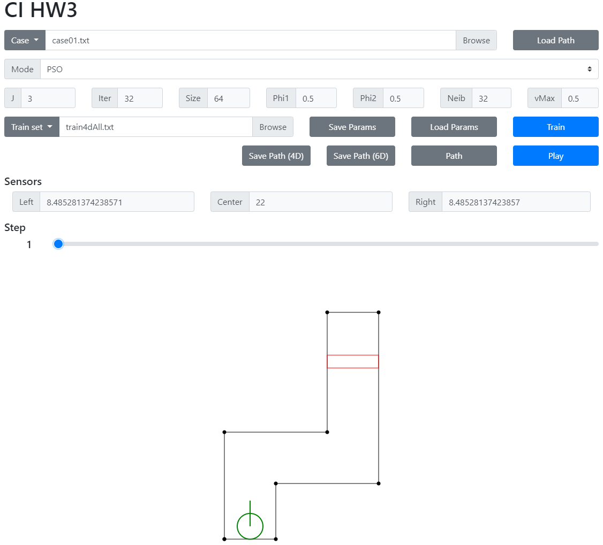
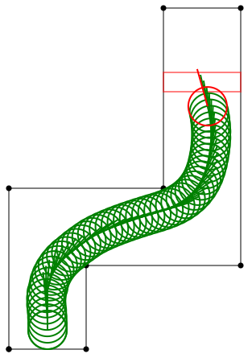

# 自走車模擬
中央大學 CE6126 計算型智慧 作業三

以PSO最佳化RBFN並用於自走車模擬

# 使用方法
1. 選擇軌道資料: 以下拉選單選擇預置軌道資料，或直接選擇檔案。
2. 選擇模式: 以下拉選單選擇使用模糊系統、基因演算法模式或PSO模式。
3. 若選擇PSO模式則可調整RBFN及PSO參數，包含：
   + J：RBFN核心數
   + Iter：PSO迭代次數
   + Size：PSO個體數
   + Phi1：PSO自身經驗參數$φ_1$
   + Phi2：PSO 群體經驗參數$φ_2$
   + Neib：PSO 群體經驗考慮之鄰近個體數
   + vMax：PSO個體最大移動速度
4. 選擇訓練資料: 以下拉選單選擇預置訓練資料，或直接選擇檔案。
5. 調整完畢後按下 Train 按鈕開始訓練。
6. 訓練完畢後按下 Play 按鈕開始播放自走車移動軌跡。
7. 按下 Path 按鈕可顯示自走車移動軌跡。
8. 按下 Save Path 按鈕可儲存自走車移動軌跡。
9. 按下 Load Path 按鈕可載入自走車移動軌跡。
10. 按下 Save Params 按鈕可儲存 RBFN 參數。
11. 按下 Load Params 按鈕可載入 RBFN 參數。
12. 拖動 Step 滑條可顯示每一時刻的自走車位置。

# PSO設計
## 自身經驗
紀錄個體所經最佳適應值的位置，以供更新位置時參考。
## 群體經驗
尋找鄰近個體中適應值最佳的個體位置作為更新位置時參考，演算法會依據Neib參數尋找離自身個體最近的相應數量的個體中適應值最佳的個體位置。
## 最大速度
個體移動的最大速度被限制在 -vMax到 vMax之間。

# 實驗結果
## train4dAll 訓練集
### 參數設定
+ RBFN核心數：3
+ PSO迭代次數：32
+ PSO個體數：64
+ PSO自身經驗參數$φ_1$：0.5
+ PSO 群體經驗參數$φ_2$：0.5
+ PSO 群體經驗考慮之鄰近個體數：32
+ PSO個體最大移動速度：0.5
### 實驗結果
本實驗在Intel® Core™ i5-4460 處理器 @ 3.40 GHz 上需訓練52.08秒，最終平均錯誤為0.107

+ train4dAll 訓練集訓練之網路所產生之路徑
  
  
